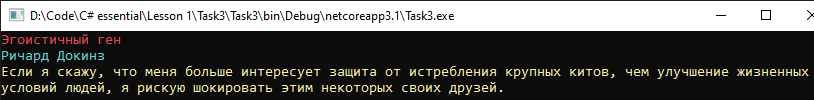

# Lesson1_task3
Условия задачки:
>Используя Visual Studio, создайте проект по шаблону Console Application.  
Требуется:  
Создать класс Book. Создать классы  Title, Author и Content, каждый из которых должен содержать одно строковое поле и метод void Show().  
Реализуйте возможность добавления в книгу названия книги, имени автора и содержания. 
Выведите на экран разными цветами при помощи метода  Show() название книги, имя автора и содержание. 

Подытог: вот такенный майндфак на выходе
>
